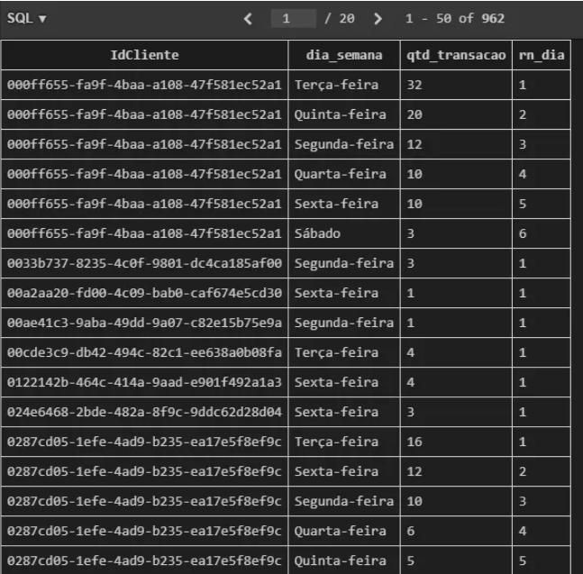
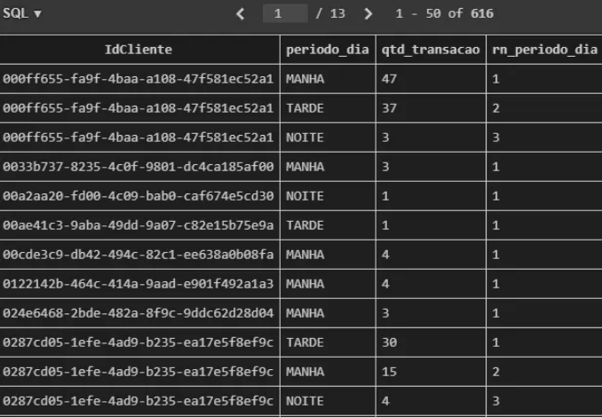
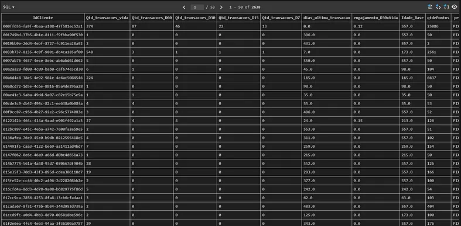
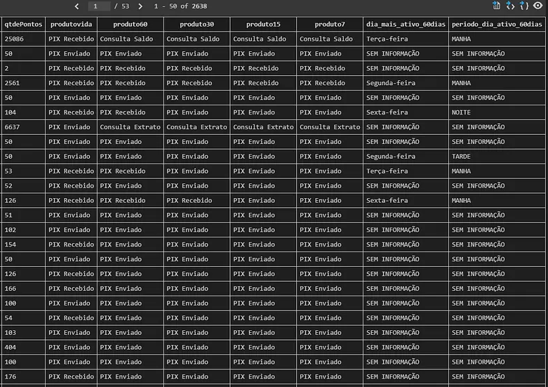

# Construindo um Perfil Comportamental de Clientes (Fintech) com SQL
<p align="left">
  
  
  
</p>

## Contexto e explicação do problema

Nos últimos meses tenho me dedicado com mais profundidade ao estudo de **SQL**, principalmente ao uso de **CTEs** e **Window Functions** para análises mais estruturadas e de melhor desempenho.

Para este projeto escolhi o mercado de **fintech**, um setor que oferece diversos serviços financeiros por aplicativo. Embora eu não atue profissionalmente nessa área, é um mercado com o qual interajo diariamente como consumidor. Justamente por isso surgiu a ideia de explorá-lo com um olhar analítico, aplicando SQL para compreender como os usuários se comportam dentro de uma plataforma financeira.

O objetivo deste trabalho **não** é gerar gráficos ou realizar análises estatísticas.  
A proposta  é **construir uma view única** que concentre as principais métricas de comportamento dos clientes, servindo como base para que áreas de negócio, como **CRM, produto e marketing**  possam tomar decisões mais assertivas.

### Métricas comportamentais definidas
- Transações históricas (vida, D7, D15, D30, D60)  
- Dias desde a última transação  
- Engajamento dos últimos 30 dias versus histórico  
- Idade na base  
- Produto mais usado (em diferentes janelas de tempo)  
- Saldo de pontos atuais  
- Dia da semana mais ativos (nos últimos 60 dias)  
- Período do dia mais ativo (nos últimos 60 dias)  

Utilizei pra esse projeto **SQLite** como banco local e desenvolvendo toda a lógica dentro do **VS Code**.
Essa view  permite as áreas de negócio identificar padrões de uso, sinais de queda de engajamento, riscos potenciais de churn, rastreamento de produtos e janelas de maior atividade.  

## Estrutura das tabelas

Para responder às perguntas de negócio, foram fornecidas **4 tabelas** principais:

### 1. `clientes`
Reúne informações cadastrais básicas do usuário:
- `idCliente` → identificador único do cliente  
- `qtdePontos` → saldo atual de pontos  
- `DtCriacao` → data de entrada na base (usada para calcular idade na base)  

### 2. `produtos`
Tabela de referência com o catálogo de produtos disponíveis:
- `IdProduto` → chave do produto  
- `DescNomeProduto` → nome do produto  
- `DescCategoriaProduto` → categoria do produto  

### 3. `transacoes`
Contém o histórico completo de transações realizadas pelos usuários:
- `IdTransacao` → identificador da transação  
- `IdCliente` → chave para o cliente  
- `DtCriacao` → data da transação  

### 4. `transacao_produto`
Faz a ponte entre transações e produtos utilizados:
- `idTransacaoProduto` → identificador do registro  
- `IdTransacao` → vínculo com a transação
- `IdProduto` → vínculo com o produto
  
<p align="center">
  
  <br/>
  <em>Figura 1 – Esquema das tabelas utilizadas no projeto</em>
</p>

## 1. Preparando a base de transações

A primeira etapa foi organizar e padronizar as datas, extrair a hora e calcular a diferença entre a data da transação e o dia de referência (**11/08/2025**).

### Funções utilizadas
- `substr()` → extrair apenas a data da transação  
- `strftime('%H')` → capturar a hora para agrupamento por período do dia  
- `julianday()` → calcular datas no formato numérico  
- `WHERE` → filtrar o período da análise para datas até 11/08/2025  
- `CTE tb_transacao` → criar uma base derivada com todas as informações calculadas

```sql
WITH

-- ======================================================
-- CTE 1: Base de transações tratada com datas e métricas
-- Data de referência da análise: 2025-08-11
-- Dialeto: SQLite
-- ======================================================
tb_transacao AS (
    SELECT
        IdCliente,
        IdTransacao,
        substr(DtCriacao, 1, 10) AS dt_criacao
)
```
<p align="center">
  
  <br/>
  <em>Figura 2 – Output da consulta  CTE 1: tb_transacao</em>
</p>

## 2. Sumário de transações por cliente
-Na CTE `tb_sumario_transacao`, consolidei:
-Total de transações (histórico de toda vida na base)
-Transações em janelas de 60, 30, 15 e 7 dias
-Dias desde a última transação
-Engajamento 30 dias x histórico total do cliente

### Funções utilizadas
- `COUNT(CASE WHEN … END)`  → conta transações apenas dentro de cada janela de dias (D60, D30, D15, D7).
- `MIN()`→ captura o menor valor de dif_date, ou seja, quantos dias se passaram desde a última transação
- `ROUND()`→ arredonda o cálculo do engajamento (transações D30 / total histórico) para 2 casas decimais, deixando o indicador mais claro
- `GROUP BY()`→ agrupa todos os cálculos no nível do cliente, garantindo que cada linha represente um único IdCliente com seus respectivos indicadores

```sql
-- ======================================================
-- CTE 2: Sumário de transações por cliente
-- ======================================================
tb_sumario_transacao AS (
    SELECT
        IdCliente,

        -- Quantidade total de transações (vida)
        COUNT(IdTransacao) AS Qtd_transacoes_vida,

        -- Quantidade de transações por janela de tempo
        COUNT(CASE WHEN dif_date <= 60 THEN IdTransacao END) AS Qtd_transacoes_D60,
        COUNT(CASE WHEN dif_date <= 30 THEN IdTransacao END) AS Qtd_transacoes_D30,
        COUNT(CASE WHEN dif_date <= 15 THEN IdTransacao END) AS Qtd_transacoes_D15,
        COUNT(CASE WHEN dif_date <= 7  THEN IdTransacao END) AS Qtd_transacoes_D7,

        -- Dias desde a última transação
        MIN(dif_date) AS dias_ultima_transacao,

        -- Engajamento últimos 30 dias x histórico do cliente
        ROUND(
            1.0 * COUNT(CASE WHEN dif_date <= 30 THEN IdTransacao END)
            / COUNT(IdTransacao),
        2) AS engajamento_D30xVida

    FROM tb_transacao
    GROUP BY IdCliente
),
```
<p align="center">
  
  <br/>
  <em>Figura 3 – Output da consulta  CTE 2: tb_sumario_transacao</em>
</p>

#### Esse bloco permite avaliar:

- Intensidade de uso
- Mudança recente no comportamento
- Risco de churn (com dias desde a última transação)
- Clientes engajados nas últimas janelas

Na prática, é possível criar campanhas de reativação para quem reduziu o engajamento.

## 3. Idade do cliente na base e pontuação atual
A CTE `tb_clientes` adiciona duas variáveis importantes:
- Qtde de pontos (indicador típico em fintechs de score )
- Idade em dias desde que o cliente entrou na plataforma

### Funções utilizadas
- `julianday()` → Obtém a Idade do cliente na base em dias subtraindo a data da analise com data do cliente na base
- `substr()`→ extrair apenas a data de criação da coluna que contem data/hora
```sql
tb_clientes AS (
    SELECT 
        IdCliente, 
        qtdePontos, 

        -- Idade do cliente na base em dias
        julianday('2025-08-11') julianday(substr(DtCriacao, 1, 10)) AS Idade_Base
    FROM clientes
),
```
<p align="center">
  
  <br/>
  <em>Figura 4 – Output da consulta  CTE 3: tb_clientes</em>
</p>

## 4. Ligando transações a produtos
A `CTE tb_transacao_produto` une transações a produtos consumidos.
```sql
-- ======================================================
-- CTE 4: Integra transações com produtos
-- ======================================================
tb_transacao_produto AS (
    SELECT 
        t1.*, 
        t3.DescNomeProduto
    FROM tb_transacao AS t1
    LEFT JOIN transacao_produto AS t2
        ON t1.IdTransacao = t2.IdTransacao
    LEFT JOIN produtos AS t3
        ON t2.IdProduto = t3.IdProduto
),
```

## 5. Construindo o uso de produtos por cliente
A CTE `tb_cliente_produto` resume o comportamento de cada cliente em relação a cada produto, mostrando:
- Quantas vezes o cliente usou o produto no total
- Quantas vezes usou o produto nos últimos 60, 30, 15 e 7 dias.

```sql
-- ======================================================
-- CTE 5: Uso de produtos por cliente
-- ======================================================
tb_cliente_produto AS (
    SELECT 
        IdCliente,
        DescNomeProduto,

        -- Uso total do produto
        COUNT(IdTransacao) AS Qtd_produto_vida,

        -- Janelas de tempo
        COUNT(CASE WHEN dif_date <= 60 THEN IdTransacao END) AS Qtd_produto_D60,
        COUNT(CASE WHEN dif_date <= 30 THEN IdTransacao END) AS Qtd_produto_D30,
        COUNT(CASE WHEN dif_date <= 15 THEN IdTransacao END) AS Qtd_produto_D15,
        COUNT(CASE WHEN dif_date <= 7  THEN IdTransacao END) AS Qtd_produto_D7

    FROM tb_transacao_produto
    GROUP BY IdCliente, DescNomeProduto
),
```
<p align="center">
  
  <br/>
  <em>Figura 5 – Output da consulta  CTE 5: tb_cliente_produto</em>
</p>
  
#### Valor Gerado pela Consulta:

- Recomendação personalizada de produtos com base em uso recente;
- Detectar migrações de comportamento (“parou de usar produto X e passou a usar Y”);
- Entender qual produto é porta de entrada.

## 6. Ranking dos produtos mais utilizados

Aqui entra uma das partes mais legais do SQL: Window function.
Usei:
`ROW_NUMBER() OVER (PARTITION BY IdCliente ORDER BY … DESC)` 
para rankear os produtos mais usados por cada cliente, tanto no histórico completo quanto em janelas de tempo recentes (últimos 60, 30, 15 e 7 dias).
Essa função atribui um número sequencial a cada linha dentro de um grupo.
- `PARTITION BY IdCliente`: separa os dados por cliente. Ou seja, cada cliente tem seu próprio ranking;
- `ORDER BY Qtd_produto_vida DESC`: dentro de cada cliente, os produtos são ordenados do mais usado para o menos usado;
- `ROW_NUMBER()`: atribui um número sequencial a cada produto, começando do 1;
- O `DESC` (ordem decrescente) é fundamental porque quero que o produto mais usado receba o número 1.

```sql
-- ======================================================
-- CTE 6: Ranking dos produtos mais utilizados por cliente
-- ======================================================
tb_rn_cliente_produto AS (
    SELECT 
        *,

        -- Ranking geral
        ROW_NUMBER() OVER (PARTITION BY IdCliente ORDER BY Qtd_produto_vida DESC) AS rn_vida,

        -- Rankings por janela
        ROW_NUMBER() OVER (PARTITION BY IdCliente ORDER BY Qtd_produto_D60 DESC) AS rn_60,
        ROW_NUMBER() OVER (PARTITION BY IdCliente ORDER BY Qtd_produto_D30 DESC) AS rn_30,
        ROW_NUMBER() OVER (PARTITION BY IdCliente ORDER BY Qtd_produto_D15 DESC) AS rn_15,
        ROW_NUMBER() OVER (PARTITION BY IdCliente ORDER BY Qtd_produto_D7 DESC)  AS rn_7
    FROM tb_cliente_produto
),
```
<p align="center">
  
  <br/>
  <em>Figura 6 – Output da consulta CTE 6: tb_rn_cliente_produto </em>
</p>

#### Valor Gerado pela Consulta:

Complementando os benefícios da etapa anterior agora é possível facilmente através de filtros identificar o produto favorito por cliente e em diferentes janelas de tempo.

## 7. Dia da semana mais ativo

Criei a CTE `tb_cliente_dia` na qual mostra a quantidade de transação por dia da semana de cada cliente, considerando somente os últimos 60 dias

### Funções utilizadas:

- `CASE + strftime(‘%w’)` → converte a data da transação em um código numérico de dia da semana (0 a 6) e associa para o nome correspondente (“Segunda”, “Terça”…);
- `COUNT()` → contabiliza quantas transações o cliente realizou em cada dia da semana;
- `GROUP BY` → agrupa o resultado por cliente e por dia da semana, garantindo uma linha para cada combinação IdCliente + dia_semana;
- `WHERE` → Garante que as transações do cliente esteja dentro da janela dos ultimos 60 dias.

```sql
-- ======================================================
-- CTE 7: Análise por dia da semana (últimos 60 dias)
-- ======================================================
tb_cliente_dia AS (
    SELECT  
        IdCliente,

        CASE strftime('%w', dt_criacao)
            WHEN '0' THEN 'Domingo'
            WHEN '1' THEN 'Segunda-feira'
            WHEN '2' THEN 'Terça-feira'
            WHEN '3' THEN 'Quarta-feira'
            WHEN '4' THEN 'Quinta-feira'
            WHEN '5' THEN 'Sexta-feira'
            WHEN '6' THEN 'Sábado'
        END AS dia_semana,

        COUNT(IdTransacao) AS qtd_transacao

    FROM tb_transacao
    WHERE dif_date <= 60
    GROUP BY IdCliente, dia_semana
),
```

## 8.Ranking do dia da semana mais ativo

Após identificar quantas transações cada cliente realizou em cada dia da semana na etapa anterior - CTE `tb_cliente_dia` - , avançamos para entender qual dia realmente se destaca para cada usuário.

CTE `tb_cliente_dia_rn` → cria um ranking para determinar o dia da semana mais ativo de cada cliente dentro dos últimos 60 dias.

Usei novamente *Window function* com a logica exatamente a mesma que na etapa 6:

`ROW_NUMBER() OVER (PARTITION BY IdCliente ORDER BY qtd_transacao DESC)` para ordenar os dias da semana pela quantidade de transações e atribui um ranking, onde rn_dia = 1 identifica o dia mais movimentado do cliente.

```sql

-- ======================================================
-- CTE 8: Ranking do dia da semana mais ativo
-- ======================================================
tb_cliente_dia_rn AS (
    SELECT 
        *,
        ROW_NUMBER() OVER (PARTITION BY IdCliente ORDER BY qtd_transacao DESC) AS rn_dia
    FROM tb_cliente_dia
),
```
<p align="center">
  
  <br/>
  <em>Figura 7 – Output da consulta  CTE 8: tb_cliente_dia_rn </em>
</p>

#### Valor Gerado pela Consulta:

Essa consulta ajuda a fintech entender o picos de dias de uso que possibilita:

- Planejamento mais inteligente de campanhas e promoções direcionando ofertas exatamente no momento mais engajado de cada cliente;
- Otimização da disponibilidade e capacidade das equipes possibilitando ajustarem escalas e recursos para dias mais ativos;
- Melhor programação de rotinas de manutenção — Identificar períodos de menor atividade para reduzir o impacto de atualizações, janelas de manutenção de infraestrutura.

## 9.Período do dia mais ativo

Semelhante ao anterior, mas agora não avaliar o engajamento por dia mas o período do dia em que o cliente é mais ativo:

```sql
-- ======================================================
-- CTE 9: Uso por período do dia (manhã/tarde/noite/madrugada) -últimos 60 dias
-- ======================================================
tb_cliente_periodo_dia AS (
    SELECT 
        IdCliente,

        CASE 
            WHEN hora BETWEEN  7 AND 12 THEN 'MANHA'
            WHEN hora BETWEEN 13 AND 18 THEN 'TARDE'
            WHEN hora BETWEEN 19 AND 23 THEN 'NOITE'
            ELSE 'MADRUGADA'
        END AS periodo_dia,

        COUNT(IdTransacao) AS qtd_transacao

    FROM tb_transacao
    WHERE dif_date <= 60
    GROUP BY IdCliente, periodo_dia
),

-- ======================================================
-- CTE 10: Ranking do período do dia mais ativo
-- ======================================================
tb_cliente_periodo_dia_rn AS (
    SELECT 
        *,
        ROW_NUMBER() OVER (PARTITION BY IdCliente ORDER BY qtd_transacao DESC) AS rn_periodo_dia
    FROM tb_cliente_periodo_dia
)
```
<p align="center">
  
  <br/>
  <em>Figura 8 – Output da consulta  CTE 10: tb_cliente_periodo_dia_rn </em>
</p>

Essa visão complementa os insights anteriores e acrescenta um nível de granularidade que permite decisões ainda mais precisas por período do dia

## 10.Tabela final: O Perfil Comportamental do Cliente

Nessa última etapa eu realizei a junção de todas as CTEs em um único SELECT final.

Essa tabela reúne, para cada cliente:

- Quantidade de transações por janela
- Dias desde a última transação
- Engajamento
- Idade na base
- Produto favorito por janela
- Dia da semana mais ativo
- Período do dia mais ativo
- Funções e técnicas utilizadas:

`LEFT JOIN` → combina os dados das CTEs mantendo todos os clientes da base principal (`tb_sumario_transacao`).
Isso garante que mesmo clientes com pouca atividade não sejam excluídos da análise.
`JOIN` com condição adicional (`AND tX.rn_ = 1`)
→ usado para trazer apenas o melhor produto ou o período/dia mais ativo por cliente.
Em vez de trazer todos os rankings, o JOIN filtra diretamente a linha que representa a posição nº 1 no ranking que é o interesse da análise
`COALESCE()` → substitui valores nulos por “SEM INFORMAÇÃO” nos campos de dia e período mais ativos.
Isso é útil quando o cliente não teve atividade nos últimos 60 dias, evitando campos vazios e deixando a tabela mais amigável para leitura

```sql
-- ======================================================
-- RESULTADO FINAL: Tabela única consolidada de perfil comportamental
-- ======================================================
SELECT 
    t1.*,
    t2.Idade_Base,
    t2.qtdePontos,

    -- Produto mais utilizado por janela
    t3.DescNomeProduto AS produtovida,
    t4.DescNomeProduto AS produto60,
    t5.DescNomeProduto AS produto30,
    t6.DescNomeProduto AS produto15,
    t7.DescNomeProduto AS produto7,

    -- Dia e período mais ativos
    COALESCE(t8.dia_semana,  'SEM INFORMAÇÃO') AS dia_mais_ativo_60dias,
    COALESCE(t9.periodo_dia, 'SEM INFORMAÇÃO') AS periodo_dia_ativo_60dias

FROM tb_sumario_transacao AS t1

LEFT JOIN tb_clientes AS t2
    ON t1.IdCliente = t2.IdCliente

LEFT JOIN tb_rn_cliente_produto AS t3
    ON t1.IdCliente = t3.IdCliente AND t3.rn_vida = 1

LEFT JOIN tb_rn_cliente_produto AS t4
    ON t1.IdCliente = t4.IdCliente AND t4.rn_60 = 1

LEFT JOIN tb_rn_cliente_produto AS t5
    ON t1.IdCliente = t5.IdCliente AND t5.rn_30 = 1

LEFT JOIN tb_rn_cliente_produto AS t6
    ON t1.IdCliente = t6.IdCliente AND t6.rn_15 = 1

LEFT JOIN tb_rn_cliente_produto AS t7
    ON t1.IdCliente = t7.IdCliente AND t7.rn_7 = 1

LEFT JOIN tb_cliente_dia_rn AS t8
    ON t1.IdCliente = t8.IdCliente AND t8.rn_dia = 1

LEFT JOIN tb_cliente_periodo_dia_rn AS t9
    ONt1.IdCliente = t9.IdCliente AND t9.rn_periodo_dia =  1 ;
```
<p align="center">
  
  <br/>
  <em>Figura 9 – Output select final: parte 1</em>
</p>

<p align="center">
  
  <br/>
  <em>Figura 10 – Output select final: parte 2</em>
</p>

## Insights Gerados e Exemplos de Uso

Com essa tabela única, uma fintech pode criar dashboards e análises estatísticas para:

1. **Produto mais utilizado (lifetime e janelas recentes)**  
   *Uso:* Personalizar ofertas, entender mudança de hábitos e direcionar campanhas de *cross-sell*. Também é possível criar sistemas de recomendação de produtos de acordo com afinidade.

2. **Engajamento histórico vs. últimos 30 dias**  
   *Uso:* Detectar queda de atividade, priorizar ações de retenção e prever risco de *churn*.

3. **Dias desde a última transação / Transações por janela (D60, D30, D15, D7)**  
   *Uso:* Criar alertas automáticos para clientes inativos e acionar comunicações de reativação. Permite clusterizar clientes em *heavy users* e usuários sazonais, ajustando limites, cashback e benefícios.

4. **Dia da semana mais ativo**  
   *Uso:* Enviar notificações no dia com maior probabilidade de engajamento e planejar capacidade operacional.

5. **Período do dia mais ativo**  
   *Uso:* Disparar mensagens no horário ideal e otimizar atendimento em tempo real.
## Conclusão

Esse projeto reforça como o SQL é uma das principais ferramentas para o analista de dados. Mesmo partindo de um conjunto simples de tabelas, é possível transformar dados brutos em insights estratégicos que ajudam negócios a tomarem decisões estratégicas.  
A construção dessa visão única foi fortemente baseada no uso de CTEs (Common Table Expressions), que se mostraram essenciais para organizar o raciocínio, dividir o problema em etapas menores e manter o código limpo. Hoje, o uso de CTEs já faz parte da minha rotina de desenvolvimento.  
Outro ponto fundamental foi o uso de Window Functions, que permitem cálculos avançados — nesse caso aplicado para ranking — sem perder granularidade por cliente.  
No fim, esse exercício mostra principalmente que com domínio das ferramentas certas, é possível extrair valor real mesmo de bases pequenas e transformar simples registros de transações em conhecimento acionável para o negócio.  

E isso é tudo por hoje! Espero que gostem deste projeto e que apreciem as informações que encontrarem após a leitura.  
Para qualquer contato ou troca de ideias, você pode me encontrar no [LinkedIn]([https://www.linkedin.com/in/seu-usuario](https://www.linkedin.com/in/davidnunes9/)).

## Tecnologias utilizadas
- VS Code  
- Extensões: SQLite e SQLite3 Editor  
- Linguagem: SQL
  
## Arquivos do projeto
- Banco de dados: `database.db`  
- Código principal: `projeto.sql`  

## Como reproduzir o projeto
- Clonar o repositório  
- Abrir no VS Code com as extensões instaladas  
- Garantir que o arquivo `database.db` esteja na raiz  
- Executar as queries do `projeto.sql` sobre o banco  
- Explorar os resultados ou conectar a uma ferramenta de BI  
## Recomendações de Aprendizado

Para quem deseja se aprofundar ainda mais em SQL, análise de dados e boas práticas de desenvolvimento, recomendo acompanhar o perfil de [Teo Calvo](https://www.linkedin.com/in/teocalvo/).  
Ele compartilha conteúdos valiosos e experiências que podem acelerar o aprendizado e trazer novas perspectivas para quem está começando ou já atua na área.


