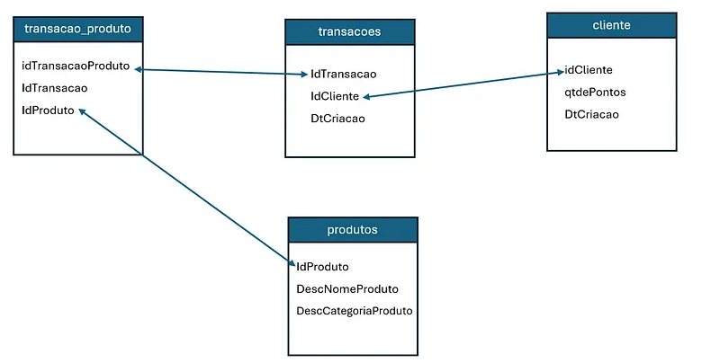

# Construindo um Perfil Comportamental de Clientes (Fintech) com SQL

  
  

## Contexto e explicação do problema

Nos últimos meses tenho me dedicado com mais profundidade ao estudo de **SQL**, principalmente ao uso de **CTEs** e **Window Functions** para análises mais estruturadas e de melhor desempenho.

Para este projeto escolhi o mercado de **fintech**, um setor que oferece diversos serviços financeiros por aplicativo. Embora eu não atue profissionalmente nessa área, é um mercado com o qual interajo diariamente como consumidor. Justamente por isso surgiu a ideia de explorá-lo com um olhar analítico, aplicando SQL para compreender como os usuários se comportam dentro de uma plataforma financeira.

O objetivo deste trabalho **não** é gerar gráficos ou realizar análises estatísticas.  
A proposta central é **construir uma view única** que concentre as principais métricas de comportamento dos clientes, servindo como base para que áreas de negócio — como **CRM, produto e marketing** — possam tomar decisões mais assertivas e embasadas em dados.

### 🔎 Métricas comportamentais definidas
- Transações históricas (vida, D7, D15, D30, D60)  
- Dias desde a última transação  
- Engajamento dos últimos 30 dias versus histórico  
- Idade na base  
- Produto mais usado (em diferentes janelas de tempo)  
- Saldo de pontos atuais  
- Dia da semana mais ativos (nos últimos 60 dias)  
- Período do dia mais ativo (nos últimos 60 dias)  

Utilizei pra esse projeto **SQLite** como banco local e desenvolvendo toda a lógica dentro do **VS Code**.
Essa view  permite as áreas de negócio identificar padrões de uso, sinais de queda de engajamento, riscos potenciais de churn, rastreamento de produtos e janelas de maior atividade.  

## Estrutura das tabelas

Para responder às perguntas de negócio, foram fornecidas **4 tabelas** principais:

### 1. `clientes`
Reúne informações cadastrais básicas do usuário:
- `idCliente` → identificador único do cliente  
- `qtdePontos` → saldo atual de pontos  
- `DtCriacao` → data de entrada na base (usada para calcular idade na base)  

### 2. `produtos`
Tabela de referência com o catálogo de produtos disponíveis:
- `IdProduto` → chave do produto  
- `DescNomeProduto` → nome do produto  
- `DescCategoriaProduto` → categoria do produto  

### 3. `transacoes`
Contém o histórico completo de transações realizadas pelos usuários:
- `IdTransacao` → identificador da transação  
- `IdCliente` → chave para o cliente  
- `DtCriacao` → data da transação  

### 4. `transacao_produto`
Faz a ponte entre transações e produtos utilizados:
- `idTransacaoProduto` → identificador do registro  
- `IdTransacao` → vínculo com a transação
- `IdProduto` → vínculo com o produto
  

  
   
  <em>Figura 1 – Esquema das tabelas utilizadas no projeto</em>

