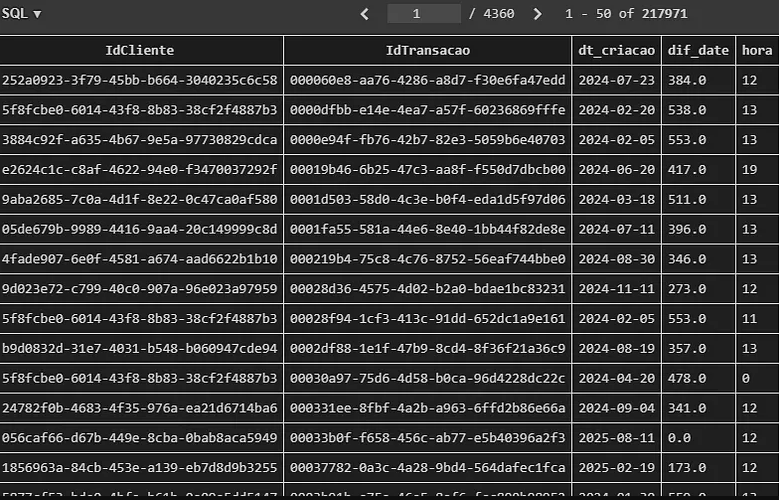
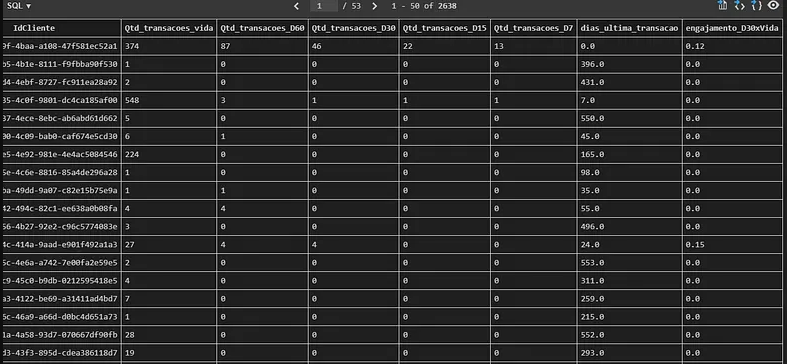
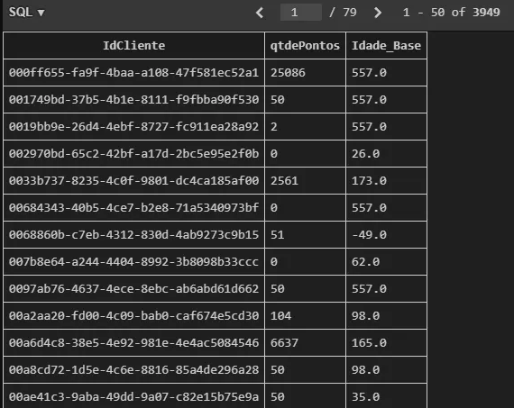
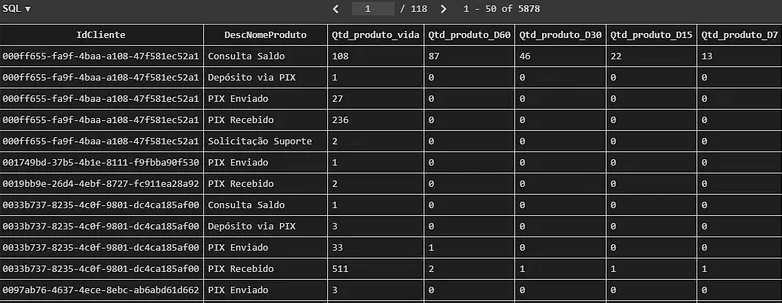
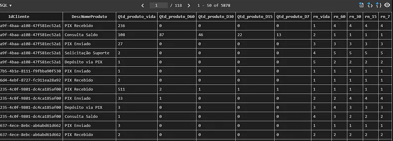

# Construindo um Perfil Comportamental de Clientes (Fintech) com SQL
<p align="left">
  
  
</p>

## Contexto e explicação do problema

Nos últimos meses tenho me dedicado com mais profundidade ao estudo de **SQL**, principalmente ao uso de **CTEs** e **Window Functions** para análises mais estruturadas e de melhor desempenho.

Para este projeto escolhi o mercado de **fintech**, um setor que oferece diversos serviços financeiros por aplicativo. Embora eu não atue profissionalmente nessa área, é um mercado com o qual interajo diariamente como consumidor. Justamente por isso surgiu a ideia de explorá-lo com um olhar analítico, aplicando SQL para compreender como os usuários se comportam dentro de uma plataforma financeira.

O objetivo deste trabalho **não** é gerar gráficos ou realizar análises estatísticas.  
A proposta  é **construir uma view única** que concentre as principais métricas de comportamento dos clientes, servindo como base para que áreas de negócio, como **CRM, produto e marketing**  possam tomar decisões mais assertivas.

### Métricas comportamentais definidas
- Transações históricas (vida, D7, D15, D30, D60)  
- Dias desde a última transação  
- Engajamento dos últimos 30 dias versus histórico  
- Idade na base  
- Produto mais usado (em diferentes janelas de tempo)  
- Saldo de pontos atuais  
- Dia da semana mais ativos (nos últimos 60 dias)  
- Período do dia mais ativo (nos últimos 60 dias)  

Utilizei pra esse projeto **SQLite** como banco local e desenvolvendo toda a lógica dentro do **VS Code**.
Essa view  permite as áreas de negócio identificar padrões de uso, sinais de queda de engajamento, riscos potenciais de churn, rastreamento de produtos e janelas de maior atividade.  

## Estrutura das tabelas

Para responder às perguntas de negócio, foram fornecidas **4 tabelas** principais:

### 1. `clientes`
Reúne informações cadastrais básicas do usuário:
- `idCliente` → identificador único do cliente  
- `qtdePontos` → saldo atual de pontos  
- `DtCriacao` → data de entrada na base (usada para calcular idade na base)  

### 2. `produtos`
Tabela de referência com o catálogo de produtos disponíveis:
- `IdProduto` → chave do produto  
- `DescNomeProduto` → nome do produto  
- `DescCategoriaProduto` → categoria do produto  

### 3. `transacoes`
Contém o histórico completo de transações realizadas pelos usuários:
- `IdTransacao` → identificador da transação  
- `IdCliente` → chave para o cliente  
- `DtCriacao` → data da transação  

### 4. `transacao_produto`
Faz a ponte entre transações e produtos utilizados:
- `idTransacaoProduto` → identificador do registro  
- `IdTransacao` → vínculo com a transação
- `IdProduto` → vínculo com o produto
  
<p align="center">
  
  <br/>
  <em>Figura 1 – Esquema das tabelas utilizadas no projeto</em>
</p>

## 1. Preparando a base de transações

A primeira etapa foi organizar e padronizar as datas, extrair a hora e calcular a diferença entre a data da transação e o dia de referência (**11/08/2025**).

### Funções utilizadas
- `substr()` → extrair apenas a data da transação  
- `strftime('%H')` → capturar a hora para agrupamento por período do dia  
- `julianday()` → calcular datas no formato numérico  
- `WHERE` → filtrar o período da análise para datas até 11/08/2025  
- `CTE tb_transacao` → criar uma base derivada com todas as informações calculadas

```sql
WITH

-- ======================================================
-- CTE 1: Base de transações tratada com datas e métricas
-- Data de referência da análise: 2025-08-11
-- Dialeto: SQLite
-- ======================================================
tb_transacao AS (
    SELECT
        IdCliente,
        IdTransacao,
        substr(DtCriacao, 1, 10) AS dt_criacao
)
```
<p align="center">
  
  <br/>
  <em>Figura 2 – Output da consulta  CTE 1: tb_transacao</em>
</p>

## 2. Sumário de transações por cliente
-Na CTE `tb_sumario_transacao`, consolidei:
-Total de transações (histórico de toda vida na base)
-Transações em janelas de 60, 30, 15 e 7 dias
-Dias desde a última transação
-Engajamento 30 dias x histórico total do cliente

### Funções utilizadas
- `COUNT(CASE WHEN … END)`  → conta transações apenas dentro de cada janela de dias (D60, D30, D15, D7).
- `MIN()`→ captura o menor valor de dif_date, ou seja, quantos dias se passaram desde a última transação
- `ROUND()`→ arredonda o cálculo do engajamento (transações D30 / total histórico) para 2 casas decimais, deixando o indicador mais claro
- `GROUP BY()`→ agrupa todos os cálculos no nível do cliente, garantindo que cada linha represente um único IdCliente com seus respectivos indicadores

```sql
-- ======================================================
-- CTE 2: Sumário de transações por cliente
-- ======================================================
tb_sumario_transacao AS (
    SELECT
        IdCliente,

        -- Quantidade total de transações (vida)
        COUNT(IdTransacao) AS Qtd_transacoes_vida,

        -- Quantidade de transações por janela de tempo
        COUNT(CASE WHEN dif_date <= 60 THEN IdTransacao END) AS Qtd_transacoes_D60,
        COUNT(CASE WHEN dif_date <= 30 THEN IdTransacao END) AS Qtd_transacoes_D30,
        COUNT(CASE WHEN dif_date <= 15 THEN IdTransacao END) AS Qtd_transacoes_D15,
        COUNT(CASE WHEN dif_date <= 7  THEN IdTransacao END) AS Qtd_transacoes_D7,

        -- Dias desde a última transação
        MIN(dif_date) AS dias_ultima_transacao,

        -- Engajamento últimos 30 dias x histórico do cliente
        ROUND(
            1.0 * COUNT(CASE WHEN dif_date <= 30 THEN IdTransacao END)
            / COUNT(IdTransacao),
        2) AS engajamento_D30xVida

    FROM tb_transacao
    GROUP BY IdCliente
),
```
<p align="center">
  
  <br/>
  <em>Figura 3 – Output da consulta  CTE 2: tb_sumario_transacao</em>
</p>

#### Esse bloco permite avaliar:

- Intensidade de uso
- Mudança recente no comportamento
- Risco de churn (com dias desde a última transação)
- Clientes engajados nas últimas janelas

Na prática, é possível criar campanhas de reativação para quem reduziu o engajamento.

## 3. Idade do cliente na base e pontuação atual
A CTE `tb_clientes` adiciona duas variáveis importantes:
- Qtde de pontos (indicador típico em fintechs de score )
- Idade em dias desde que o cliente entrou na plataforma

### Funções utilizadas
- `julianday()` → Obtém a Idade do cliente na base em dias subtraindo a data da analise com data do cliente na base
- `substr()`→ extrair apenas a data de criação da coluna que contem data/hora
```sql
tb_clientes AS (
    SELECT 
        IdCliente, 
        qtdePontos, 

        -- Idade do cliente na base em dias
        julianday('2025-08-11') julianday(substr(DtCriacao, 1, 10)) AS Idade_Base
    FROM clientes
),
```
<p align="center">
  
  <br/>
  <em>Figura 4 – Output da consulta  CTE 3: tb_clientes</em>
</p>

## 4. Ligando transações a produtos
A `CTE tb_transacao_produto` une transações a produtos consumidos.
```sql
-- ======================================================
-- CTE 4: Integra transações com produtos
-- ======================================================
tb_transacao_produto AS (
    SELECT 
        t1.*, 
        t3.DescNomeProduto
    FROM tb_transacao AS t1
    LEFT JOIN transacao_produto AS t2
        ON t1.IdTransacao = t2.IdTransacao
    LEFT JOIN produtos AS t3
        ON t2.IdProduto = t3.IdProduto
),
```

## 5. Construindo o uso de produtos por cliente
A CTE `tb_cliente_produto` resume o comportamento de cada cliente em relação a cada produto, mostrando:
- Quantas vezes o cliente usou o produto no total
- Quantas vezes usou o produto nos últimos 60, 30, 15 e 7 dias.

```sql
-- ======================================================
-- CTE 5: Uso de produtos por cliente
-- ======================================================
tb_cliente_produto AS (
    SELECT 
        IdCliente,
        DescNomeProduto,

        -- Uso total do produto
        COUNT(IdTransacao) AS Qtd_produto_vida,

        -- Janelas de tempo
        COUNT(CASE WHEN dif_date <= 60 THEN IdTransacao END) AS Qtd_produto_D60,
        COUNT(CASE WHEN dif_date <= 30 THEN IdTransacao END) AS Qtd_produto_D30,
        COUNT(CASE WHEN dif_date <= 15 THEN IdTransacao END) AS Qtd_produto_D15,
        COUNT(CASE WHEN dif_date <= 7  THEN IdTransacao END) AS Qtd_produto_D7

    FROM tb_transacao_produto
    GROUP BY IdCliente, DescNomeProduto
),
```
<p align="center">
  
  <br/>
  <em>Figura 5 – Output da consulta  CTE 5: tb_cliente_produto</em>
</p>
  
#### Benefícios analíticos:

- Recomendação personalizada de produtos com base em uso recente;
- Detectar migrações de comportamento (“parou de usar produto X e passou a usar Y”);
- Entender qual produto é porta de entrada.

## 6. Ranking dos produtos mais utilizados

Aqui entra uma das partes mais legais do SQL: Window function.
Usei:
`ROW_NUMBER() OVER (PARTITION BY IdCliente ORDER BY … DESC)` 
para rankear os produtos mais usados por cada cliente, tanto no histórico completo quanto em janelas de tempo recentes (últimos 60, 30, 15 e 7 dias).
Essa função atribui um número sequencial a cada linha dentro de um grupo.
- `PARTITION BY IdCliente`: separa os dados por cliente. Ou seja, cada cliente tem seu próprio ranking;
- `ORDER BY Qtd_produto_vida DESC`: dentro de cada cliente, os produtos são ordenados do mais usado para o menos usado;
- `ROW_NUMBER()`: atribui um número sequencial a cada produto, começando do 1;
- O `DESC` (ordem decrescente) é fundamental porque quero que o produto mais usado receba o número 1.

```sql
-- ======================================================
-- CTE 6: Ranking dos produtos mais utilizados por cliente
-- ======================================================
tb_rn_cliente_produto AS (
    SELECT 
        *,

        -- Ranking geral
        ROW_NUMBER() OVER (PARTITION BY IdCliente ORDER BY Qtd_produto_vida DESC) AS rn_vida,

        -- Rankings por janela
        ROW_NUMBER() OVER (PARTITION BY IdCliente ORDER BY Qtd_produto_D60 DESC) AS rn_60,
        ROW_NUMBER() OVER (PARTITION BY IdCliente ORDER BY Qtd_produto_D30 DESC) AS rn_30,
        ROW_NUMBER() OVER (PARTITION BY IdCliente ORDER BY Qtd_produto_D15 DESC) AS rn_15,
        ROW_NUMBER() OVER (PARTITION BY IdCliente ORDER BY Qtd_produto_D7 DESC)  AS rn_7
    FROM tb_cliente_produto
),
```
<p align="center">
  
  <br/>
  <em>Figura 6 – Output da consulta CTE 6: tb_rn_cliente_produto </em>
</p>

#### Benefícios analíticos:

Complementando os benefícios da etapa anterior agora é possível facilmente através de filtros identificar o produto favorito por cliente e em diferentes janelas de tempo.


  


